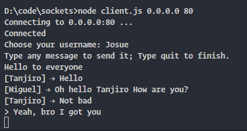

# Sockets

## **Definition**

A socket is a software endpoint that enables communication between two processes or programs over a network. It provides a bidirectional communication channel between a client and a server, allowing them to send and receive data in real-time. Sockets can be used for a variety of network applications, such as web browsing, email, file transfer, and real-time chat or gaming. They are an essential building block for many network protocols and applications, and are widely used in client-server architectures.

## **How to use this code?**

Steps to use it:

- First you need to start the server.js like this:

```shell
$ node server.js SOME_PORT  # You can set any port like: 80, 8080, 5000, or anyone else
```

- Second you have to create one or many clients, like this:

```shell
$ node client.js 0.0.0.0 SOME_PORT  # This has to be the same port of the server
```

## Capture of the program running:

<center>



</center>

Here you can see a client connenting to the server.js that is running in the port 80. And you can see how the new client uses the name _"Josue"_ and start entering to a conversation.
